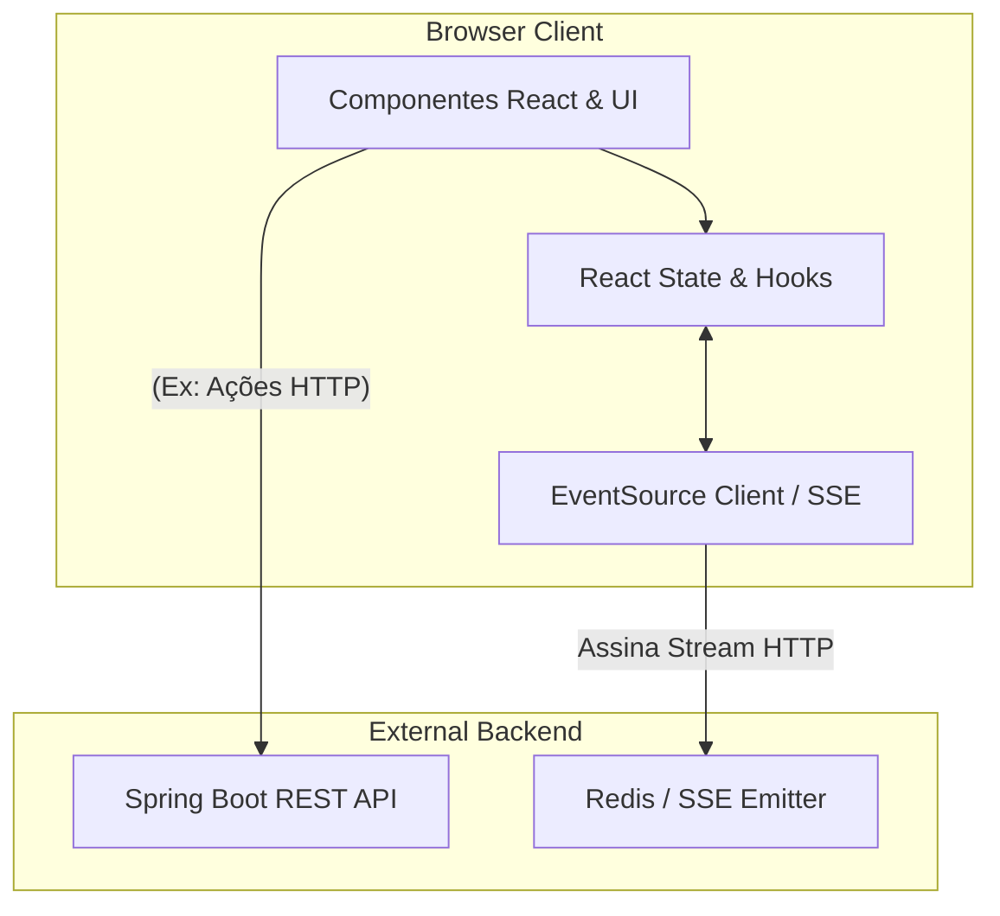

# Frontend Architecture Document - FlowPay

Este documento detalha o desenho estrutural da interface (SPA) do FlowPay, priorizando performance máxima e reatividade real-time.

## 1. Topologia da Arquitetura (React + Vite)

O dashboard opera inteiramente no browser e é consumido via edge network (CDN) em produção.

## 2. Estratégia de Atualização de UI (Zero-Polling)

Tradicionalmente, Dashboards operacionais efetuam *Long-Polling* (bater na API a cada 3 segundos) para saber "quantos chats estão na fila". Isso derruba o banco de dados.

No FlowPay Frontend adotamos **Reatividade Pura via SSE**:
1. O backend emite a *Foto da Operação* (Snapshot) inteira sempre que *qualquer* métrica sofre alteração.
2. O arquivo `SseClient.ts` deserializa o payload.
3. O componente React no topo da árvore (`Dashboard.tsx`) repassa (prop-drilling raso) os valores para os componentes folha.
4. O uso de **Micro-Interações Visuais** (`AnimatedNumber`) com `useRef` permite comparar `valorNovo vs valorAntigo`. Se o número inflar, ele pisca em verde; se desinflar, em vermelho. A experiência do usuário (UX) avisa que algo se moveu sem distraí-lo.

## 3. Estrutura de Pastas e Responsabilidades

*   `/src/components/`: Reutilizáveis agnósticos. O `Layout.tsx` lida com o Navbar/Sidebar, deixando o conteúdo ser injetado via `children`.
*   `/src/pages/`: Representam as "Telas" do React Router (`Dashboard.tsx`). Elas detém as lógicas de fetch ou assinatura SSE.
*   `/src/services/`: Lógica pesada isolada de UI. `sseClient.ts` abstrai o objeto DOM `EventSource`, garantindo que o React não lide diretamente com erros de rede, apenas leia os dados formatados.
*   `/src/types/`: Tipagem estrita que espelha exatamente as classes de Record/DTO do Java.

## 4. Gerenciamento de CSS (Tailwind v4)

A nova engine V4 (`@tailwindcss/vite`) retira a necessidade de arquivos pesados de configuração (`tailwind.config.js`). As cores de design premium do projeto (glassmorphism via *backdrop-blur*, tons slate/emerald e identidade visual Clean Corporate Light da Ubots) são definidas em `index.css` e distribuídas amplamente pelos componentes via utilitários atômicos.

## 5. Gerenciamento de Estado (Zustand)

Para logs operacionais da aplicação e monitoramento de requests HTTP, o frontend utiliza o pacote `zustand` em uma store descentralizada (`logsStore.ts`). Ao contrário do SSE, que opera sob escopo unificado, o Zustand permite que a lista de Logs circule entre o interceptor global do Axios (`api.ts`), a tela de Logs (`Logs.tsx`) e o widget da página principal, sem envolver _Prop-Drilling_.

## 6. Operações Assíncronas (CRUD & Axios)

As entidades principais (Times e Agentes) interagem através de modais na interface. O controle das requisições POST/PUT/DELETE usa instâncias do `axios` encapsuladas no arquivo `api.ts`, interceptando toda solicitação antes dela ser disparada ou quando for retornada. Esta camada garante que erros do tipo Constraints Violations gerem alertas visuais uniformizados (Toasts) amigáveis ao usuário, desvinculando o React de lógicas pesadas de serialização.
